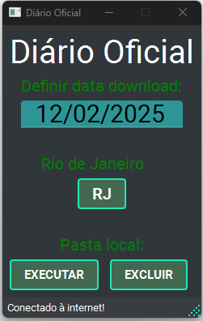

# AUTOMATIZAÇÃO DE CADASTRO
 
**Automatização de pesquisa na WEB**

- Este projeto consiste em um “bot” onde o usuário apenas seleciona uma data qualquer do calendário. A parti deste feito o programa busca no site do Diário Oficial do Rio de Janeiro o arquivo em PDF, onde extrairá entre dezenas de paginas informações de cadastro de funcionários públicos como nome, matricula, profissão e portaria ou resolução, salvos em uma planilha em Excel de fácil manipulação.  

- Passos para execução do programa:
    - Execute o programa __main.py__:
        - Abrirá uma janela de APP;
    - Após a abertura do APP, selecione uma data valida do calendário posterior ao dia atual (hoje) já digitada no display do APP;
    - Click no botão __RJ__;
    - Aguarde a execução do programa, se a data selecionada existir o Diário Oficial o programa ira extrair do site o arquivo em PDF e realizará download do arquivo em uma pasta local chama PDF.
    - O programa criará uma pasta temporária chamada DPF_EM_TXT onde converte o PDF em arquivo texto para analise de processo;
    - Em seguida, criar uma terceira pasta chamada CADASTRO onde irá armazenar dois arquivo um arquivo de texto com resumo dos parágrafos extraído do arquivo PDF Diário Oficial e um arquivo em Excel, contendo uma planilha com as colunas: NOME, SITUAÇÃO ATUAL, PROFISSÃO, MATRÍCULA, APOSENTADORIA, NÚMERO DO PROCESSO.

- Extra:
    - No roda pé do APP será exibido as etapas do processo ou estado do aplicativo;
    - No APP existe dos botões extras chamados EXECUTAR e EXCLUIR:
    - Botão EXECUTAR: o programa executar doto os processos de cadastro dos arquivos existentes na pasta PDF local, em um único relatórios. Ex: caso tenham três Diários Oficiais na pasta PDF, os três arquivos serão copilados, extraído os dados em um único cadastro, conforme os moldes descrito acima, pulando a etapa de extração dos arquivos na internet.
    - Botão EXCLUIR: O APP irá excluir as pastas locais PDF e CADASTRO com os respectivos arquivos dentro, porem é necessário confirmar a exclusão, pois não será possível recuperação dos arquivos excluídos.

- Principais tecnologias:
>>>>>>> Stashed changes
